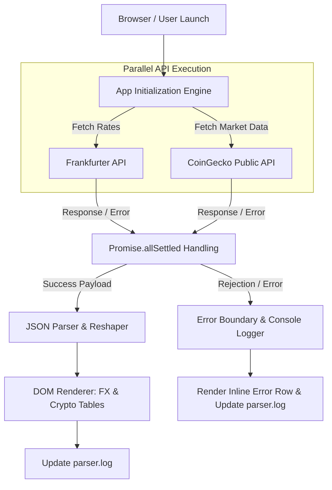
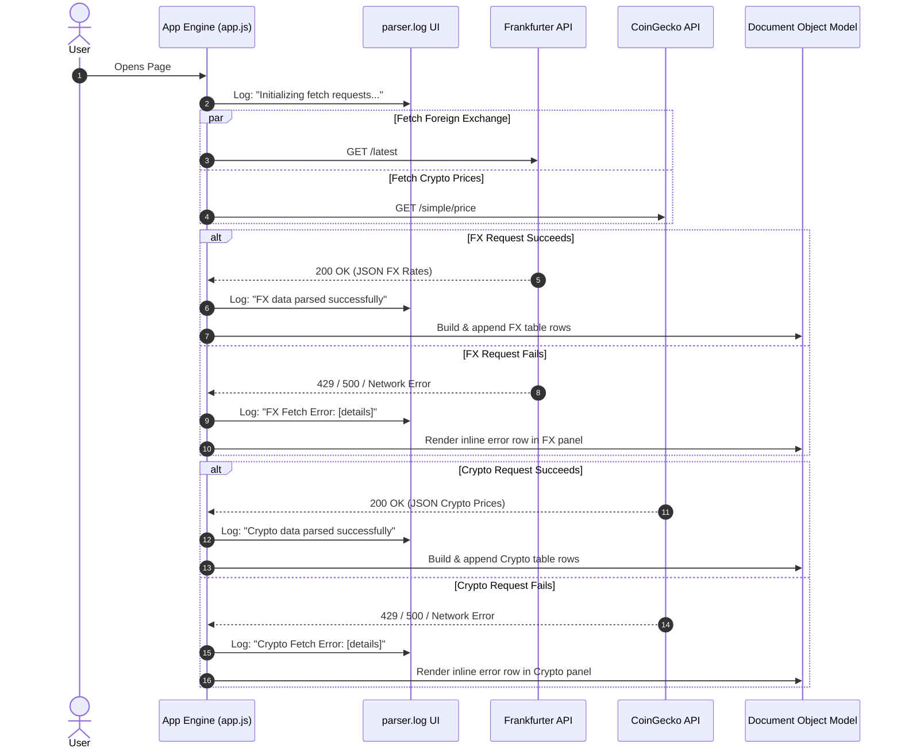
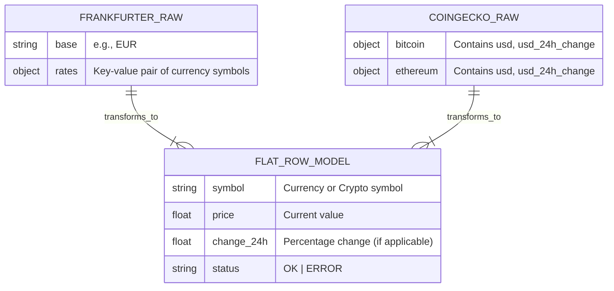

```markdown
# RateFeed — Live Currency & Crypto Parser
https://ddaijin.github.io/
A single-page JavaScript application that fetches data from two public, keyless JSON APIs entirely client-side, parses the payload asynchronously, and renders real-time data tables. Built with pure web standards: zero backend, no build tools, no external fonts, and no heavy frameworks — relying strictly on `fetch`, `async/await`, and native DOM manipulation.

---

## Technical Highlights & Architecture

* **Parallel Asynchronous Fetching:** Executes API calls concurrently using `Promise.allSettled()`, ensuring isolated failure domains (a failure in one API will not affect or block the other).
* **Safe DOM Manipulation:** Renders dynamic rows using `document.createElement()` and `textContent` to prevent XSS vulnerabilities instead of using unsanitized `innerHTML` string building.
* **Resilient Error Handling:** Intercepts network or rate-limiting errors inline without breaking the overall page layout.
* **On-Page Log Console:** Features a live execution log ("parser.log") that visualizes the fetch-to-render pipeline step-by-step in real time.

---

## Application Diagrams

### 1. High-Level Pipeline Architecture



---

### 2. Parallel Fetch & State Sequence Diagram



---

### 3. Data Transformation Flow



---

## Data Sources

| Panel | API Provider | Auth Required | Details & Rate Limits |
| --- | --- | --- | --- |
| **Foreign Exchange** | [Frankfurter](https://frankfurter.dev) (`api.frankfurter.dev`) | None | European Central Bank reference rates for ~31 currencies, updated every business day. |
| **Crypto Markets** | [CoinGecko Public Endpoint](https://www.coingecko.com/en/api) (`api.coingecko.com`) | None | Public endpoint with a rate limit of ~30 calls/minute. |

Both APIs require no API key or sign-up and have CORS headers enabled, allowing direct calls from browser-side JavaScript.

---

## Tech Stack

* **Markup & Styles:** HTML5, CSS3
* **Scripting Language:** Vanilla JavaScript (ES6+ with `async`/`await`, `Promise.allSettled`, and DOM APIs)
* **Font Stack:** Native OS system fonts (`-apple-system`, `Segoe UI`, `Roboto`, `ui-monospace`, `Consolas`) to prevent external HTTP font-loading overhead.

---

## Project Structure

```text
rate-parser/
├── index.html        # Main HTML layout, table containers, and log console UI
├── css/
│   └── style.css     # CSS reset, layout grid, typography, and theme styling
├── js/
│   └── app.js        # API requests, JSON normalization, DOM rendering, and logging
└── README.md

```

---

## Running Locally

Because this project is entirely static and relies on public CORS-enabled endpoints, no build steps are required.

```bash
git clone [https://github.com/dDaijin/dDaijin.github.io.git](https://github.com/dDaijin/dDaijin.github.io.git)
cd dDaijin.github.io

# Serve locally using Python
python3 -m http.server 8000

```

Open `http://localhost:8000` in your web browser. Alternatively, opening `index.html` directly in modern web browsers will also work smoothly.

---

## Deployment

Compatible with any static site host including GitHub Pages, Vercel, Netlify, or Cloudflare Pages. Simply direct the host to the repository root directory.

---

## Disclaimers & Notes

* **Educational Purpose:** Exchange rates and cryptocurrency prices rendered in this application are for demonstration and informational purposes only and do not constitute financial advice.
* **Fault Tolerance:** If a request is blocked (e.g., due to strict ad-blockers, offline network status, or API rate limits), the affected component displays a fallback error row while continuing to operate all other application panels.

---

## License

MIT License

```

```
